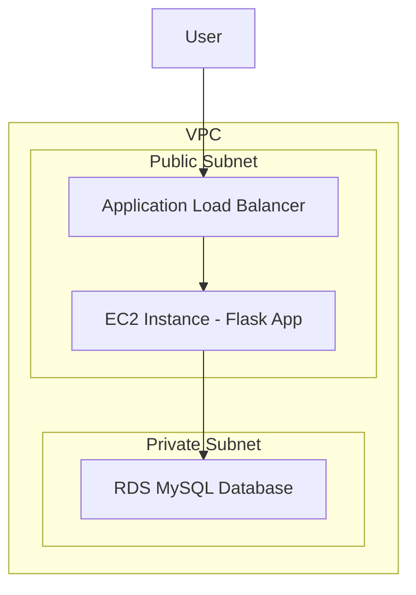

# Design Document

## Overview

This design outlines a simple web application architecture deployed on AWS using EC2 and RDS. The solution consists of a Python Flask web application running on an EC2 instance that collects user input through HTML forms and stores the data in an RDS MySQL database. The entire infrastructure will be provisioned using CloudFormation templates.

## Architecture

The architecture follows a simple 2-tier pattern:



### Key Components:
- **VPC**: Custom VPC with public and private subnets
- **EC2 Instance**: t3.micro instance running Amazon Linux 2 with Flask application
- **RDS MySQL**: db.t3.micro MySQL database in private subnet
- **Application Load Balancer**: For high availability and SSL termination
- **Security Groups**: Proper network access controls

## Components and Interfaces

### 1. Infrastructure Components (CloudFormation)

#### VPC and Networking
- Custom VPC with CIDR 10.0.0.0/16
- Public subnet (10.0.1.0/24) for EC2 and ALB
- Private subnet (10.0.2.0/24) for RDS
- Internet Gateway and Route Tables
- NAT Gateway for private subnet internet access

#### Security Groups
- **ALB Security Group**: Allow HTTP (80) and HTTPS (443) from internet
- **EC2 Security Group**: Allow HTTP (5000) from ALB, SSH (22) from specific IP
- **RDS Security Group**: Allow MySQL (3306) from EC2 security group only

#### EC2 Instance
- Instance Type: t3.micro (free tier eligible)
- AMI: Amazon Linux 2
- User Data script for automatic application setup
- IAM role with necessary permissions

#### RDS Database
- Engine: MySQL 8.0
- Instance Class: db.t3.micro
- Storage: 20GB GP2
- Multi-AZ: false (for cost optimization)
- Backup retention: 7 days

### 2. Application Components (Python Flask)

#### Flask Web Application Structure
```
app/
├── app.py              # Main Flask application
├── requirements.txt    # Python dependencies
├── templates/
│   ├── index.html     # Form page
│   └── success.html   # Success page
├── static/
│   └── style.css      # Basic styling
└── config.py          # Database configuration
```

#### Database Schema
```sql
CREATE TABLE user_submissions (
    id INT AUTO_INCREMENT PRIMARY KEY,
    name VARCHAR(100) NOT NULL,
    email VARCHAR(100) NOT NULL,
    message TEXT,
    created_at TIMESTAMP DEFAULT CURRENT_TIMESTAMP
);
```

## Data Models

### User Submission Model
```python
class UserSubmission:
    def __init__(self, name, email, message):
        self.name = name
        self.email = email
        self.message = message
        self.created_at = datetime.now()
    
    def save_to_db(self, connection):
        # Save to MySQL database
        pass
```

### Database Connection
- Use pymysql driver for MySQL connectivity
- Connection pooling for better performance
- Environment variables for database credentials
- Automatic reconnection handling

## Error Handling

### Application Level
- Form validation for required fields
- Email format validation
- Database connection error handling
- Graceful error pages for users

### Infrastructure Level
- Health checks for EC2 instance
- RDS automated backups
- CloudWatch monitoring and alarms
- Auto-recovery for EC2 instances

### Security Considerations
- Database credentials stored in AWS Systems Manager Parameter Store
- Security groups with least privilege access
- No hardcoded credentials in application code
- SSL/TLS encryption for data in transit

## Testing Strategy

### Local Testing
- SQLite database for local development
- Docker container for consistent environment
- Unit tests for form validation
- Integration tests for database operations

### AWS Testing
- CloudFormation template validation
- Infrastructure testing with AWS CLI
- Application deployment verification
- End-to-end testing of form submission

### Monitoring
- CloudWatch logs for application logs
- CloudWatch metrics for EC2 and RDS
- Simple health check endpoint (/health)
- Database connection monitoring

## Deployment Strategy

### Phase 1: Infrastructure Setup
1. Deploy CloudFormation stack
2. Verify all resources are created
3. Test connectivity between components

### Phase 2: Application Deployment
1. SSH to EC2 instance
2. Deploy Flask application
3. Configure systemd service
4. Test application functionality

### Phase 3: Validation
1. Test form submission
2. Verify data storage in database
3. Test error scenarios
4. Performance validation